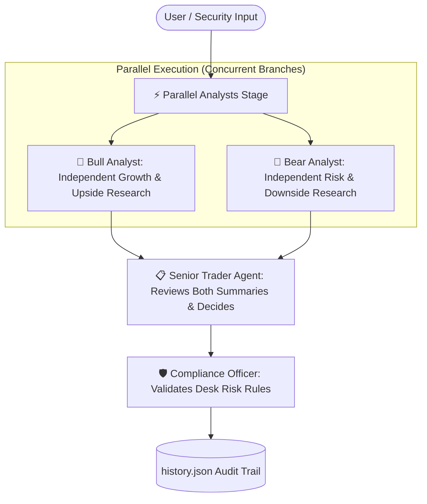

# Institutional Market Signal Desk (Google ADK)

A production-grade multi-agent equity analysis desk built using **Google Agent Development Kit (ADK)** and Gemini models. This workspace runs **Bull** and **Bear** analysts **in parallel** (`ParallelAgent`), then passes both summaries to the **Trader Agent** (`SequentialAgent`) to make an unbiased adjudication.

---

## 🏛️ Architecture Overview

The system combines Google ADK's `ParallelAgent` (concurrent fan-out) and `SequentialAgent` (pipeline fan-in):



### Agents & Responsibilities

| Agent | Execution Mode | Role & Capabilities | Output |
| :--- | :--- | :--- | :--- |
| **🐂 Bull Analyst** | **Parallel** (Concurrent) | Growth-focused equity analyst searching upside catalysts | Data-backed BUY thesis with 6-month momentum & catalyst summary |
| **🐻 Bear Analyst** | **Parallel** (Concurrent) | Short-side & risk analyst searching downside headwinds | Skeptical SELL thesis analyzing valuation stretch, drawdown & debt load |
| **📋 Senior Trader** | **Sequential** (Fan-In) | Reviews both parallel reports objectively, checks desk history | Weighs upside vs downside and issues final **BUY / SELL / HOLD** |
| **🛡️ Compliance Officer** | **Sequential** (Guardrail) | Independent risk gatekeeper enforcing non-negotiable rules | Validates Beta, P/E, cooling-off period; logs approved trades |

---

## 📁 Project Structure

```text
a4_market_signal_agent/
├── agent.py                 # Core ADK root_agent (Parallel Analysts -> Trader -> Compliance)
├── instructions.py          # Detailed instructions for Bull, Bear, Trader, and Compliance
├── tools.py                 # 8 native ADK tools with Yahoo Finance fallback
├── demo_parallel_trader.py  # Standalone runner: Parallel Bull/Bear -> Trader Decision
├── demo_01_single.py        # Standalone runner: Single Bull Analyst research
├── demo_02_multi.py         # Standalone runner: Sequential debate
├── demo_03_guardrail.py     # Standalone runner: 4-agent flow with compliance guardrail
├── history.json             # Persistent audit trail of logged recommendations
└── README.md                # This documentation
```

---

## 🚀 How to Run

Ensure your virtual environment is active and `GOOGLE_API_KEY` is set in the root `.env` file.

### 1. Single Agent Demo (Bull Analyst)
Runs a deep-dive growth analysis on any global ticker (US stocks e.g. `AAPL`, `NVDA`, `TSLA` or Indian stocks e.g. `RELIANCE.NS`, `BSE.NS`):
```bash
python demo_01_single.py AAPL
```

### 2. Multi-Agent Debate (Bull → Bear → PM)
Runs the 3-agent sequential debate where Bull and Bear argue, and the Portfolio Manager logs the final trade:
```bash
python demo_02_multi.py NVDA
```

### 3. Full 4-Agent Desk with Compliance Guardrail
Runs the complete institutional workflow where the PM's proposal must pass the Compliance Officer's risk checks:
```bash
python demo_03_guardrail.py TSLA
```

### 4. Interactive Google ADK Web UI
Launch Google ADK's built-in browser interface to interactively query the desk:
```bash
python -m google.adk.cli web .
```
Open `http://127.0.0.1:8000` in your browser and select `trade_desk`.

---

## 📊 Sample Audit Trail (`history.json`)

Approved trades are automatically logged to `history.json` with full audit fields:

```json
[
  {
    "timestamp": "2026-09-22T03:15:00",
    "ticker": "AAPL",
    "action": "BUY",
    "confidence": 3,
    "price": 242.50,
    "reasoning": "Strong 6-month momentum (+18.2%) supported by revenue acceleration...",
    "compliance_verdict": "APPROVE",
    "compliance_rule": "All checks passed"
  }
]
```
